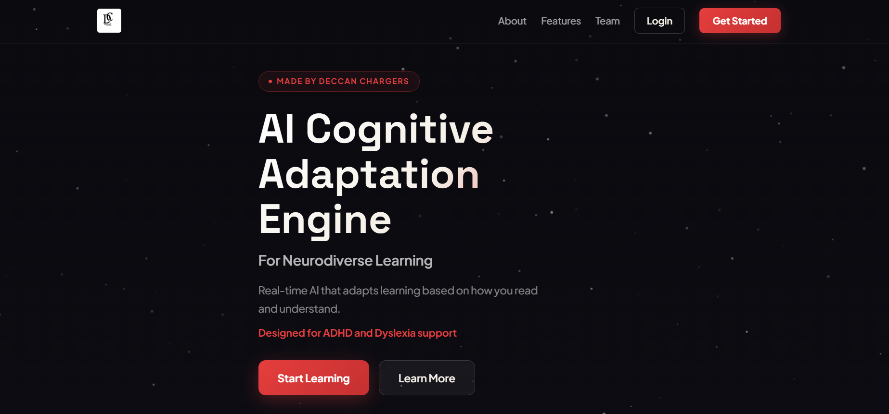
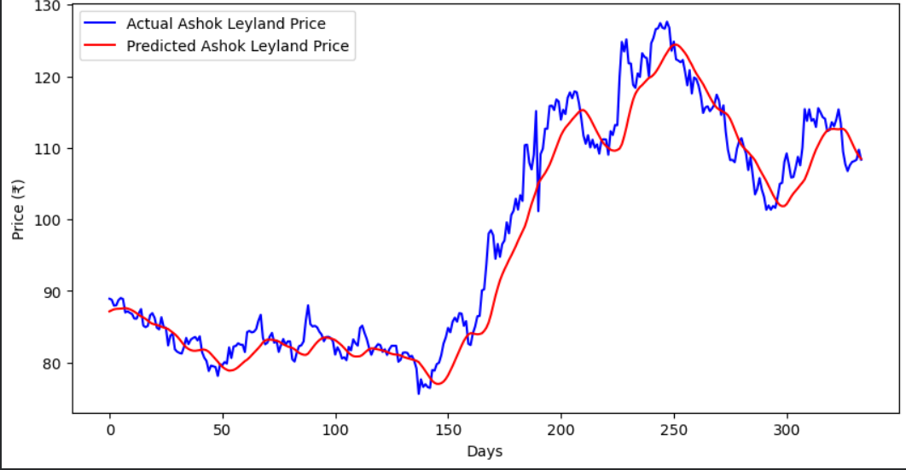
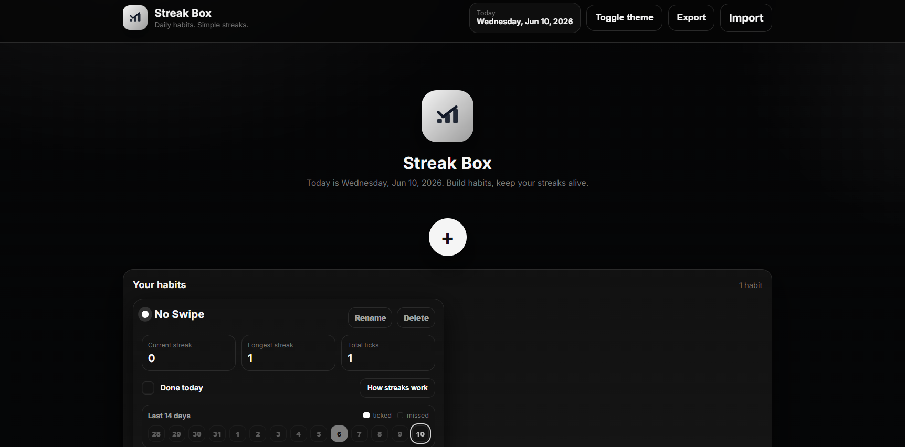
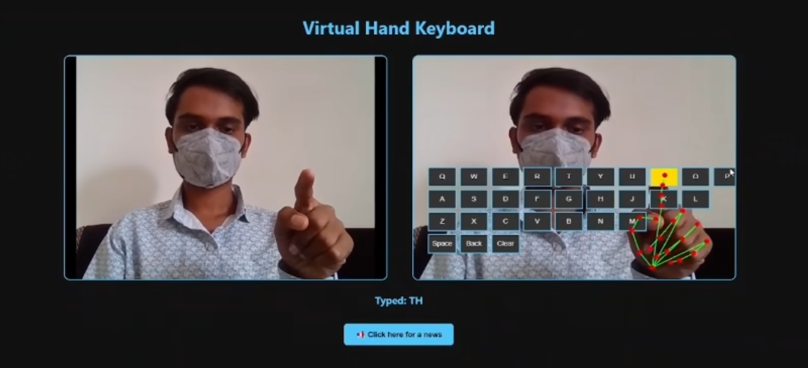

  

<h1 align="center">I'M HARSHIL GURJAR</h1> 

AI x Space-Tech Enthusiast 

Curiosity is probably my biggest skill.

Give me an interesting idea, and I'll probably spend the next few days learning everything about it, building it, and pushing it to GitHub. Most of my projects start with a simple question: "Can I actually build this?"

---

<table>
<tr>
<td>

### 🤖 Currently Working On
- Stock Market Prediction Using Machine Learning and Data Analysis
- Sentiment Analysis Tool 📊

### 📘 Currently Learning
I'm currently learning AI, Machine Learning, Deep Learning, and NLP.

### 🤝 Open to Collaborate
Looking to connect with AI-focused people to build impactful projects together.

### 📩 Reach Me

📧 **Email:** [hdgurjar2323@gmail.com](mailto:hdgurjar2323@gmail.com)

🌐 **Explore:** [hdgurjar.netlify.app](https://hdgurjar.netlify.app/)

  📈 <strong>Reach:</strong>
  
  

</td>

<td>
  
</td>

</tr>
</table>

---

# 💻 Tech Stack

<table width="100%">
<tr>
<td>

### 💻 Languages

<table>
<tr>
<td align="center" width="100">
 <b>Java</b>
</td>
<td align="center" width="100">
 <b>Python</b>
</td>
<td align="center" width="100">
 <b>C</b>
</td>
</tr>
</table>

### 🌐 Web Development

<table>
<tr>
<td align="center" width="100">
 <b>HTML5</b>
</td>
<td align="center" width="100">
 <b>CSS3</b>
</td>
<td align="center" width="100">
 <b>JavaScript</b>
</td>
</tr>
</table>

### 🗄️ Databases

<table>
<tr>
<td align="center" width="100">
 <b>MySQL</b>
</td>
<td align="center" width="100">
 <b>SQLite</b>
</td>
</tr>
</table>

### 🛠️ Tools

<table>
<tr>
<td align="center" width="100">
 <b>Git</b>
</td>
<td align="center" width="100">
 <b>GitHub</b>
</td>
<td align="center" width="100">
 <b>VS Code</b>
</td>
<td align="center" width="100">
 <b>IntelliJ</b>
</td>
<td align="center" width="100">
 <b>Eclipse</b>
</td>
</tr>
</table>

### 🚀 Deployment Platforms

<table>
<tr>
<td align="center" width="100">
 <b>Netlify</b>
</td>
<td align="center" width="100">
 <b>Vercel</b>
</td>
<td align="center" width="100">
 
</td>
</tr>
</table>

### 🤖 AI / ML & Image Processing

<table>
<tr>
<td align="center" width="100">
 
</td>
<td align="center" width="100">
 
</td>
<td align="center" width="100">
 
</td>
<td align="center" width="100">
 
</td>
</tr>
</table>

### 📚 Core CS Concepts

<table>
<tr>
<td align="center" width="150">
 
</td>
<td align="center" width="150">
 
</td>
<td align="center" width="150">
 
</td>
</tr>
</table>

### 🧠 AI Development Tools
<table>
<tr>
<td align="center" width="150">
 
</td>
<td align="center" width="150">
 
</td>
<td align="center" width="150">
 
</td>
<td align="center" width="150">
 
</td>

<td align="center" width="150">
 
</td>
 </tr>
  <tr>
<td align="center" width="150">
 
</td>
<td align="center" width="150">
 
</td>
</tr>
</table>

</td>
</tr>
</table>

---

### 🏆 Highlights

<table width="100%">
<tr>

<td align="center" width="50%">

<h2>🚀 10+</h2>

<b>AI & Software Projects</b> 
6+ Live Hosted Applications

</td>

<td align="center" width="50%">

<h2>🏆 5+</h2>

<b>Hackathons</b> 
Led & Participated in Multiple Events

</td>

</tr>

<tr>
<td colspan="2">

</td>
</tr>

<tr>

<td align="center">

<h2>🪙 150+</h2>

<b>GFG Coins</b> 
Active Problem Solver

</td>

<td align="center">

<h2>💻 30+ </h2>

<b>LeetCode</b> 
Continuously Improving Problem Solving

</td>

</tr>

</table>

---

### 🔗 Social & Contact

&nbsp;&nbsp

&nbsp;&nbsp

&nbsp;&nbsp

&nbsp;&nbsp

---

### 💻 Coding Profiles

&nbsp;&nbsp;&nbsp;&nbsp;&nbsp;&nbsp;

&nbsp;&nbsp;&nbsp;&nbsp;&nbsp;&nbsp;

---

### 🚀 Featured Projects

<table>

<tr>

<td width="50%" valign="top">

### 🧠 Cognify Learning

AI-assisted learning platform delivering personalized learning experiences.

**Tech:** HTML • CSS • JavaScript • AI • Responsive UI

</td>

<td width="50%" valign="top">

### 📈 Stock Predictor

Machine learning model for analyzing historical stock prices and forecasting trends.

**Tech:** Python • Google Colab • Machine Learning • Model Training

</td>

</tr>

<tr>

<td width="50%" valign="top">

### 📋 Strex

Productivity-focused application for habit tracking and workflow management.

**Tech:** HTML • CSS • JavaScript • Local Storage • Vercel

</td>

<td width="50%" valign="top">

### ⌨️ Virtual Keyboard

Interactive virtual keyboard controlled through an intuitive on-screen interface.

**Tech:** HTML • CSS • JavaScript • Netlify

</td>

</tr>

</table>

---

### 📊 GitHub Stats

---

### ⭐ Thanks for Stopping By!

### If any project caught your attention, let's connect and build something awesome together.

 

&nbsp;&nbsp;

  

<i>"Curiosity builds projects. Projects build experience."</i>

---
